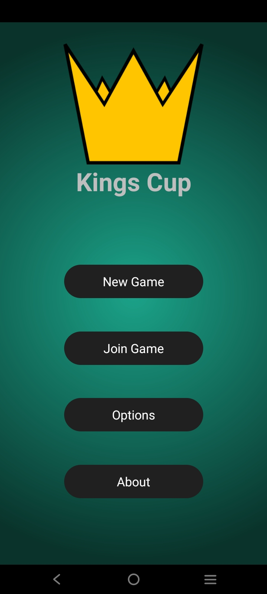
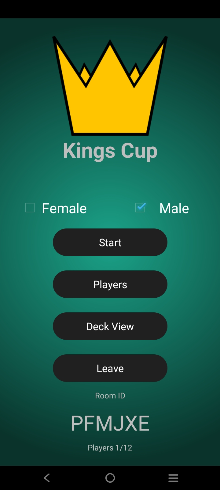
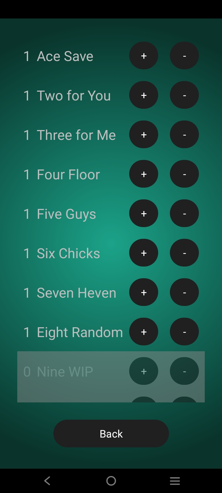
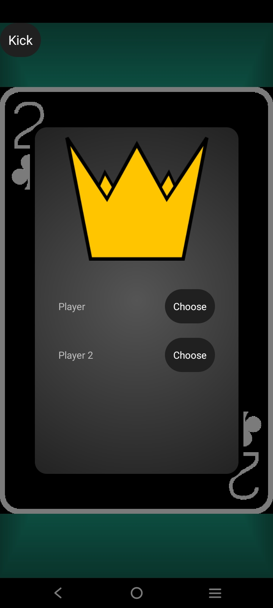
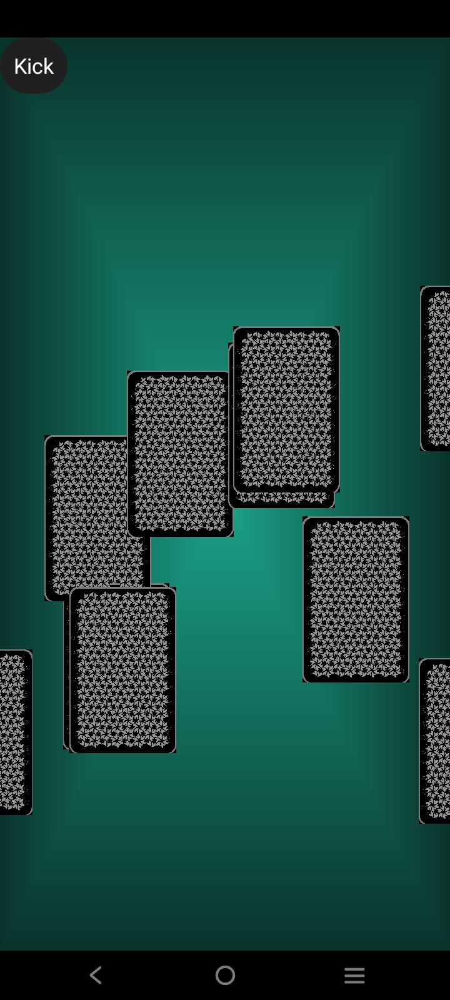

# KingsCup
### Kings Cup is an Android implementation of a card drinking game written in Kotlin.

It enables users to connect over the network to play this game without needing to meet in person. It uses the host phone as the game server and synchronizes with other users using Firebase Realtime Database.

## Build
To build and install, run the following commands:
```
./gradlew build
./gradlew installDebug
```

## Some Screenshots from the App

<table>
  <tr>
    <td></td>
    <td></td>
    <td></td>
  </tr>
    <tr>
    <td></td>
    <td></td>
    <td></td>
  </tr>
</table>